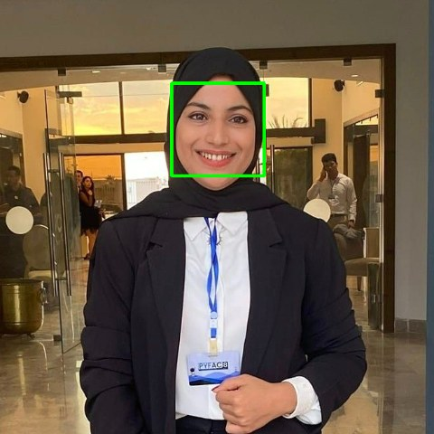

# Real-Time Face Detection with OpenCV 🙂

Small computer-vision project (ENIS, 2023): detects human faces live from the webcam and draws a box around each one, using OpenCV's pre-trained Haar cascade classifier.


<p align="center"></p>

## How it works

1. Each webcam frame is converted to grayscale.
2. The **Haar cascade** `haarcascade_frontalface_default.xml` (shipped with OpenCV) scans the frame at several scales
   (`scaleFactor=1.1`, `minNeighbors=5`, faces of at least 30 × 30 px).
3. A green rectangle is drawn around every detected face and the frame is displayed.

A Haar cascade is a chain of simple classifiers trained on thousands of positive (face) and negative images;
each stage quickly rejects regions that are clearly not a face, which makes it fast enough for real-time video.

## Run it

```bash
pip install "opencv-python<5"   # CascadeClassifier is no longer in the OpenCV 5 main package
python face_detection.py      # press "q" to quit
```

The same code is available as a notebook: `Human_face_detection.ipynb`.

## Author

**Hadil Ben Rhouma** — [Portfolio](https://portfilio-gules-three.vercel.app/?utm_source=github) · [LinkedIn](https://www.linkedin.com/in/hadil-benrhouma/)
